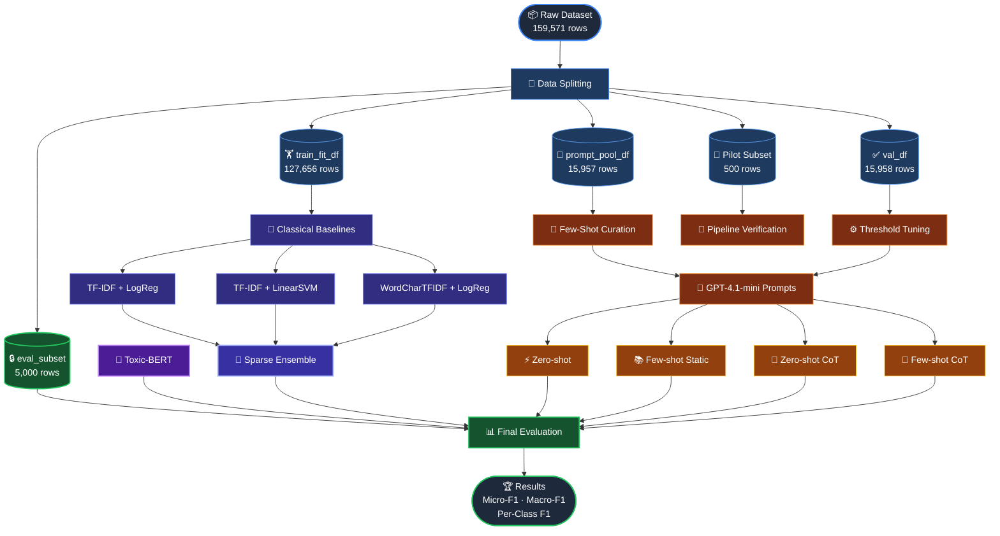

# LLM Toxic Comment Classification

**Multi-Label Toxicity Detection with Prompt Engineering, Classical Baselines & Transformer Benchmarking**

---

## 🧭 Table of Contents

- [Overview](#-overview)
- [Key Results](#-key-results)
- [Dataset & Sampling Pipeline](#-dataset--sampling-pipeline)
- [Label Distribution](#-label-distribution)
- [Prompt Engineering](#-prompt-engineering)
- [Model Selection](#-model-selection)
- [Per-Class Results](#-per-class-results)
- [Project Structure](#-project-structure)
- [Setup & Installation](#-setup--installation)
- [Conclusions](#-conclusions)
- [References](#-references)

## 📌 Overview

This project compares **three modelling paradigms** for multi-label toxic comment classification on the [Jigsaw dataset](https://www.kaggle.com/c/jigsaw-toxic-comment-classification-challenge), with prompt-based LLM inference as the central focus.

<div align="center">

| 🧮 Family | 🤖 Models | 🎯 Role |
|-----------|-----------|---------|
| **Classical Baseline** | TF-IDF + LogReg · TF-IDF + SVM · WordCharTFIDF + LogReg · Sparse Ensemble | Lexical reference points |
| **LLM — Prompt-Based** | GPT-4.1-mini × 4 prompt variants | ***Central analytical focus*** |
| **Transformer** | Toxic-BERT | Strong supervised benchmark |

</div>

**Six target labels:**


## 🏆 Key Results

*Final held-out evaluation · 5,000 rows*

<div align="center">

| 🥇 Rank | Model | Micro-F1 | Macro-F1 | Hamming Loss |
|---------|-------|----------|----------|--------------|
| 🥇 | **Toxic-BERT** | **0.6890** | **0.6295** | 0.0300 |
| 🥈 | Sparse Majority Ensemble | 0.6420 | 0.5780 | 0.0351 |
| 🥉 | WordCharTFIDF + LogReg | 0.6371 | 0.5943 | 0.0382 |
| 4 | TF-IDF + LogReg | 0.6336 | 0.5703 | 0.0369 |
| 5 | TF-IDF + LinearSVM | 0.6222 | 0.5240 | 0.0355 |
| 6 | GPT-4.1-mini · **Zero-shot** | 0.6031 | 0.5729 | 0.0296 |
| 7 | GPT-4.1-mini · Zero-shot CoT | 0.6001 | 0.5652 | 0.0290 |
| 8 | GPT-4.1-mini · Few-shot static | 0.5900 | 0.5565 | 0.0285 |
| 9 | GPT-4.1-mini · Few-shot CoT | 0.5774 | 0.5544 | 0.0290 |

</div>

> 💡 **Key finding:** Plain **Zero-shot** outperformed all other LLM variants on the 5,000-row evaluation, even though the 500-row pilot had ranked Zero-shot CoT first — validating the importance of staged, large-scale evaluation.

---

## 📉 Dataset & Sampling Pipeline

The raw corpus of **159,571 labelled training comments** was reduced through four deliberate stages:
```
┌─────────────────┐     ┌──────────────────┐     ┌──────────────┐     ┌──────────┐
│   159,571 rows  │ ──► │  ~15,000 rows    │ ──► │  5,000 rows  │ ──► │ 500 rows │
│  Full corpus    │     │  Prompt pool +   │     │  Final eval  │     │  Pilot   │
│                 │     │  Validation set  │     │  (held-out)  │     │  Debug   │
└─────────────────┘     └──────────────────┘     └──────────────┘     └──────────┘
```

### 📂 Data Splits

<div align="center">

| Split | Size | Purpose |
|-------|------|---------|
| `train_fit_df` | 127,656 rows | Fit classical sparse baselines |
| `prompt_pool_df` | 15,957 rows | Few-shot example selection |
| `val_df` | 15,958 rows | Prompt comparison & threshold tuning |
| `eval_subset` ⭐ | **5,000 rows** | ***Final held-out evaluation*** |
| Pilot subset | 500 rows | Pipeline verification & early screening |

</div>

> ✅ All splits are **mutually exclusive** — pairwise overlap checks confirmed zero data leakage.

The **500-row pilot** and **5,000-row subset** served fundamentally different roles:
- 🔬 **Pilot (500)** → rapid pipeline verification, early prompt screening, low cost
- 📊 **Final eval (5,000)** → stable metrics, rare-label coverage, trustworthy comparison

---

## 📊 Label Distribution

*From the 159,571-row training file*

<div align="center">

| Label | Positive Count | Rate | Rarity |
|-------|---------------|------|--------|
| `toxic` | 15,294 | 9.58% | ██████████ Common |
| `obscene` | 8,449 | 5.29% | █████░░░░░ |
| `insult` | 7,877 | 4.94% | █████░░░░░ |
| `severe_toxic` | 1,595 | 1.00% | █░░░░░░░░░ |
| `identity_hate` | 1,405 | 0.88% | █░░░░░░░░░ |
| `threat` | 478 | 0.30% | ░░░░░░░░░░ Rare |

</div>

---

## 🔬 Prompt Engineering

Four LLM variants evaluated using **GPT-4.1-mini** with structured JSON outputs enforced.

<div align="center">

| Variant | Base Prompt | Curated Examples (14) | CoT Instruction |
|---------|:-----------:|:---------------------:|:---------------:|
| Zero-shot | ✅ | ❌ | ❌ |
| Few-shot static | ✅ | ✅ | ❌ |
| Zero-shot CoT | ✅ | ❌ | ✅ |
| Few-shot CoT | ✅ | ✅ | ✅ |

</div>

### ⚙️ Curated vs CoT — Key Distinction

> These are **orthogonal interventions**, not the same thing:
>
> - 📚 ***Curated*** = *what examples* the model sees — a fixed bank of 14 manually selected examples covering clean negatives, common positives, hard labels, and near-miss boundary cases
> - 🧠 ***CoT*** = *how* the model reasons — an instruction to think internally before returning the final JSON label vector, without outputting any reasoning

### 📋 Base Prompt Template (Zero-shot)
```
You are an expert toxic comment classifier.

Label definitions:
- toxic:         rude, hostile, abusive, or clearly disrespectful language
- severe_toxic:  extremely abusive, degrading, or dehumanising language
- obscene:       vulgar, profane, or sexually explicit offensive wording
- threat:        explicit threat of physical harm — anger alone is NOT enough
- insult:        direct personal attack or name-calling
- identity_hate: abusive attack on a protected identity group — mentioning a group is NOT enough

Decision rules:
1. MULTI-LABEL: more than one label can be 1
2. Be conservative — assign 1 only with clear textual evidence
3. If evidence is weak or ambiguous, assign 0
...

Classify this comment: "<comment_text_here>"

Return ONLY: {"toxic":0,"severe_toxic":0,"obscene":0,"threat":0,"insult":0,"identity_hate":0}
```

---

## 🤖 Model Selection

### 🧮 Classical Sparse Baselines

| Model | Features | Notes |
|-------|----------|-------|
| TF-IDF + Logistic Regression | Word-level | Fast, interpretable |
| TF-IDF + Linear SVM | Word-level | Strong on text |
| WordCharTFIDF + LogReg | Word + character n-grams | Captures obfuscated slurs |
| **Sparse Majority Ensemble** | All of the above | **Best classical result** |

> Character n-grams were included because abusive language frequently involves spelling variation, obfuscation, and stylised profanity that whole-word matching misses *(Bestgen, 2021)*.

### 💬 LLM — GPT-4.1-mini

The final design centres on **one model** rather than spreading effort across multiple LLMs — an empirical decision based on early experiments showing GPT-4.1-mini produced the strongest and most stable results. Using one model also keeps prompt-variant comparisons clean and unconfounded.

### 🧠 Transformer — Toxic-BERT

Toxic-BERT is a pretrained transformer fine-tuned specifically for toxicity detection. It serves as the **performance ceiling** in this study — not an LLM prompting alternative — representing what a fully supervised, task-oriented neural model can achieve.

---

## 📈 Per-Class Results

*F1 score for the strongest model in each family · 5,000-row held-out set*

<div align="center">

| Label | 🧠 Toxic-BERT | 🧮 Sparse Ensemble | 💬 GPT-4.1-mini Zero-shot |
|-------|:------------:|:-----------------:|:------------------------:|
| `toxic` | **0.6973** | 0.6619 | 0.5867 |
| `insult` | **0.7126** | 0.6371 | 0.6288 |
| `obscene` | **0.7216** | 0.7031 | 0.6423 |
| `identity_hate` | **0.6267** | 0.5298 | 0.5465 |
| `threat` | 0.6087 | 0.6122 | **0.6275** |
| `severe_toxic` | **0.4098** | 0.3239 | 0.4058 |

</div>

> 💡 The LLM is most competitive on `threat` and `severe_toxic` — rare, boundary-sensitive labels where conservative precision-first behaviour is less penalised.

---
## 🗂️ Project Structure & Pipeline

---

## ⚙️ Setup & Installation
```bash
# 1. Clone the repo
git clone https://github.com/your-username/llm-toxic-comment-classification.git
cd llm-toxic-comment-classification

# 2. Create virtual environment
python -m venv venv
source venv/bin/activate        # Windows: venv\Scripts\activate

# 3. Install dependencies
pip install -r requirements.txt

# 4. Set your OpenAI API key
export OPENAI_API_KEY="your-api-key-here"
```

**Download the dataset** from [Kaggle](https://www.kaggle.com/c/jigsaw-toxic-comment-classification-challenge/data) and place files in `data/`:
```
data/
├── train.csv
├── test.csv
└── test_labels.csv
```

### ▶️ Reproducing Results
```bash
jupyter notebook notebooks/01_eda_preprocessing.ipynb
jupyter notebook notebooks/02_classical_baselines.ipynb
jupyter notebook notebooks/03_llm_inference.ipynb       # ⚠️ incurs OpenAI API costs
jupyter notebook notebooks/04_evaluation.ipynb
```

> ⚠️ Use the **500-row pilot** subset in notebook 03 for quick testing. Use the **5,000-row** subset to reproduce the reported results.

---

## ✅ Conclusions

> **1. Transformer wins overall.**
> Toxic-BERT outperforms both the LLM and classical families on most labels, benefiting from task-specific fine-tuning.

> **2. Classical baselines remain surprisingly strong.**
> TF-IDF-based models outperform all LLM variants — lexical signals are powerful for this task.

> **3. Zero-shot beats few-shot at scale.**
> Curated examples improved precision but hurt recall by over-correcting predictions. Plain Zero-shot was the best final LLM.

> **4. Pilot rankings are unstable.**
> The 500-row pilot ranked Zero-shot CoT first; the 5,000-row final evaluation ranked plain Zero-shot first. Both stages were necessary.

> **5. Prompt engineering is valuable but not sufficient.**
> LLM prompting without fine-tuning produces a workable classifier but does not match supervised approaches under the present implementation.

---

## 📚 References

- Fortuna, P., Soler-Company, J., & Wanner, L. (2021). *How well do hate speech, toxicity, abusive and offensive language classification models generalize across datasets?* Information Processing & Management.
- Chen, B., et al. (2025). *Unleashing the potential of prompt engineering for large language models.* Patterns.
- Arslan, M., & Cruz, C. (2024). *Business text classification with imbalanced data.* Applied Network Science.
- Bestgen, Y. (2021). *Character n-gram features for hate speech detection.* Journal of Computational Social Science.
- Beleites, C., et al. (2013). *Sample size planning for classification models.* Analytica Chimica Acta.
- Yuan, L., et al. (2024). *Multi-label text classification based on label attention and correlation networks.* PLOS ONE.

---

<div align="center">

*Business Analytics Project · Jigsaw Toxic Comment Classification Dataset*

</div>


